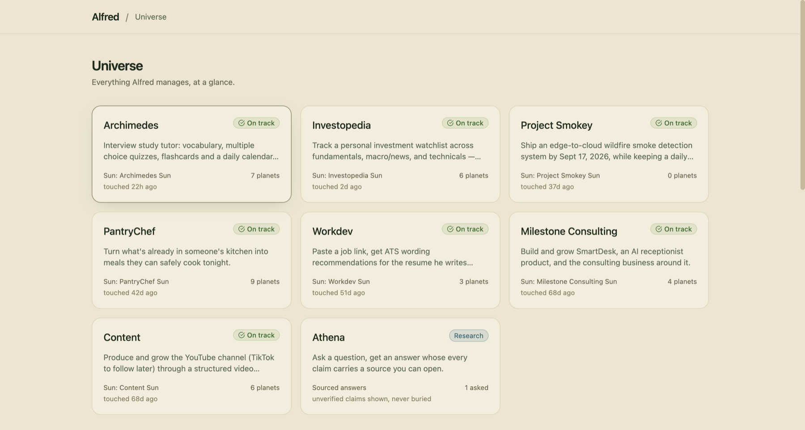
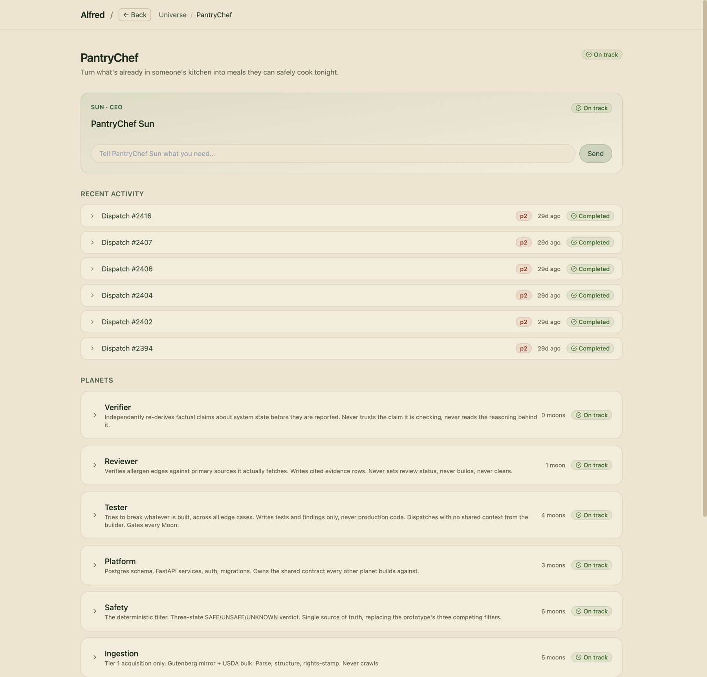
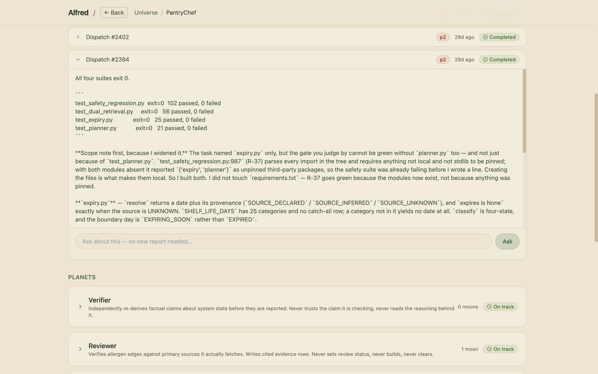
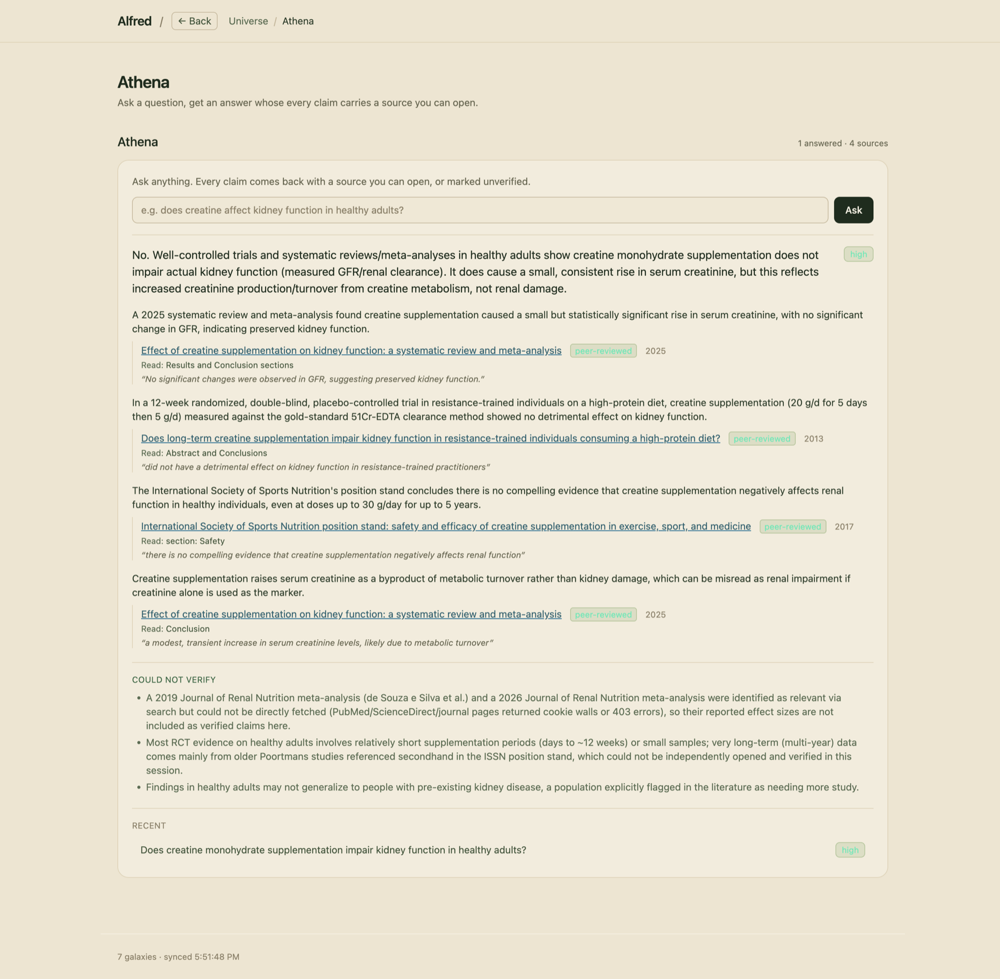
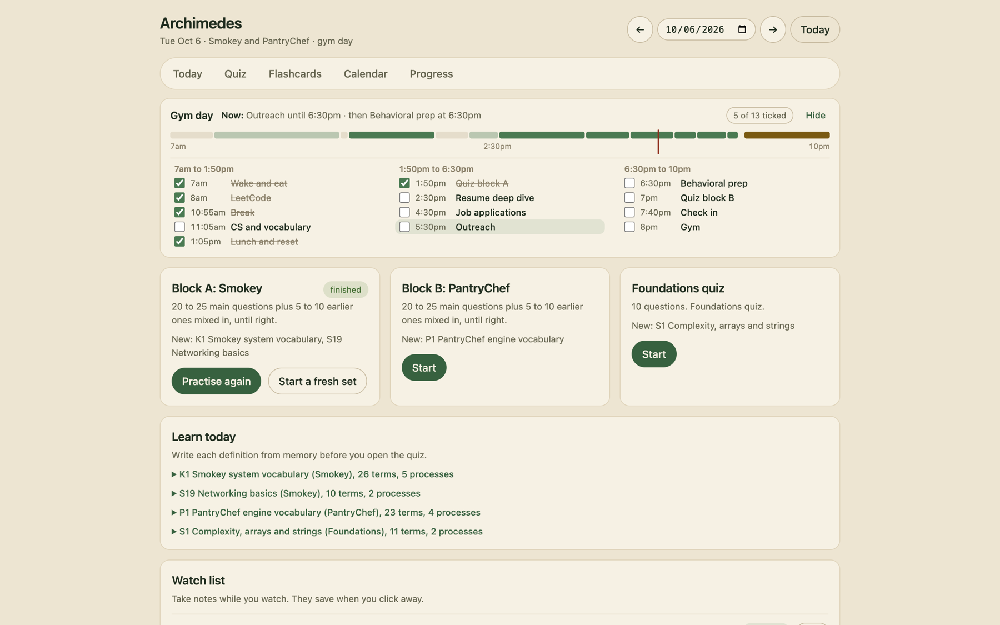
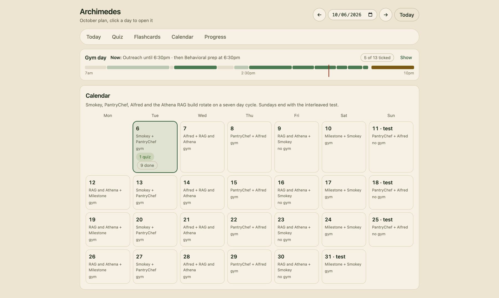
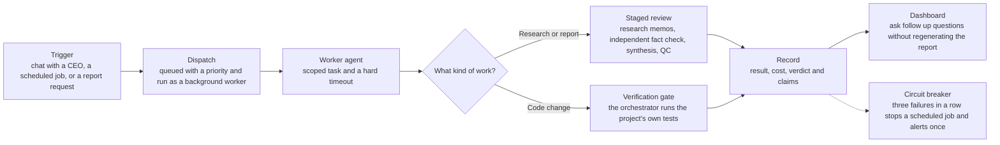
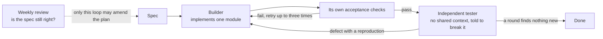

# Alfred

Alfred is the system I built to run my own projects with AI agents. Each project gets a CEO agent that manages a team of specialists, and the work they produce goes through checks built for that kind of work.

It runs on my laptop and manages my real projects. It is a one person system, not a product.

> **This repository is a showcase.** The source code, agent prompts, data and credentials are private on purpose. What is here is what Alfred does, how it is organized, and how a request moves through it. I am happy to walk through the code in an interview.

## What it looks like

### The universe

Every project Alfred manages is a galaxy. One page shows all of them, with live status and when each one was last touched.



### A team

Open a galaxy and you get its CEO (called the Sun), a chat box that talks to that CEO, a feed of recent work, and the team underneath. Each specialist (a planet) has one narrow job and a written contract. Each planet holds its tasks (moons).

This is PantryChef, a recipe app built around allergen safety. The Tester is told to try to break whatever was built, to write tests and never production code, and to work with no shared context from the builder.



### Work that comes back with receipts

A worker was asked to add one module. It finished, ran four test suites, and reported 204 passing and 0 failing. It also said up front that it had widened its own scope, and why: the safety suite could not pass without a second module. Any result can be questioned directly from the page, so a follow up does not mean regenerating the whole report.



### Athena, a cited fact checker

Athena answers a question and shows what the answer rests on. Every claim carries a source you can open, the section that was read, and a quoted passage. Anything it could not verify is listed under its own heading instead of being quietly stated as fact. This is the example I reach for first when I explain the rest of the system, because the same rule turns up everywhere else in Alfred: say plainly when something is unchecked.



### Archimedes, my study tutor and schedule

Archimedes is the tutor I use to prepare for interviews. It holds 1,682 questions in seven banks (one for each project, plus foundations and AI industry topics) and a spaced repetition flashcard deck.

The Today view lays the day out as a timeline with a marker for the current time, tick boxes for each block, the two quiz blocks for that day's projects, the vocabulary to write from memory before a quiz opens, and the coding problems for the day. The quiz rules are fixed. There are at most four choices, one retry after a wrong first pick, an explanation after every question, and a miss comes back in the same session until I get it right on the first try. Each block mixes 20 to 25 main questions with 5 to 10 earlier ones. Every answer is stored so a nightly check in can read the scores.



The Calendar view spreads the month over a seven day rotation across Smokey, PantryChef, Alfred, Milestone and the Athena RAG build, with an interleaved test every Sunday.



## How it is organized

```
Universe
  Galaxy       one per project or life system
    Sun        the CEO. Coordinates and reviews. Does not do the work.
      Planet   a specialist with one responsibility and a written contract
        Moon   one task assigned to a planet
```

Right now that is 7 galaxies, 7 CEOs, 35 specialist roles and 55 tracked tasks, plus Athena as a standalone research surface. A role is a written contract. The agents are not long running processes: a worker starts with the role's contract when there is work, and ends when the work is done.

| Galaxy | What it is | Team |
|---|---|---|
| PantryChef | Turns what is in someone's kitchen into meals they can safely cook, with allergen checks built into the engine | Safety, Ontology, Ingestion, Platform, Modernization, Reviewer, Tester, Verifier, Chronicle |
| Workdev | Turns a job link into resume wording advice and a revisable cover letter | Posting Analyst, then ATS Doctor and Letter Writer in parallel |
| Archimedes | Interview study tutor with 1,682 questions in seven banks, spaced repetition flashcards and a daily schedule | Tutor Engine plus one planet per subject |
| Investopedia | Research on a personal watchlist. Informational only. It never trades and never gives personal financial advice | Fundamental, Macro and News, Technical, Market Intelligence, Tech Disruption Watch, Research |
| Project Smokey | Day by day plan and coding tutor for an edge to cloud wildfire smoke detector | CEO only, no planets. The CEO plans and replans the days |
| Milestone Consulting | An AI receptionist product and the consulting business around it | Research, Development, Marketing, Testing |
| Content | A video production pipeline from storyboard to render, with a human approved upload | Storyboard, Assets, Animation, Narration, Render, QA |
| Athena | A cited fact checker. Every claim carries a source you can open, and unsourced claims are reported as unverified | One researcher worker per question, with retrieval planned |

## How a request moves through it



1. **Trigger.** I type to a CEO, a schedule fires, or I ask for a report.
2. **Dispatch.** The request becomes a row with a priority, a status and a cost. A background worker picks it up. Workers are Claude Code sessions run through the local CLI, so there is no separate API bill.
3. **Work.** The worker gets a scoped task, the role's contract and a hard timeout. Rate limits, expired logins and timeouts are each recorded as their own outcome instead of all being called "failed".
4. **Check.** Research goes through a staged review: specialists write memos in parallel, a separate reviewer fact checks and cross references them, the CEO synthesizes the final report, and a quality pass reads it. Code changes are followed by a gate that the orchestrator runs itself, outside the worker's reach.
5. **Record.** Result, cost (child runs rolled into the parent), verdict and extracted claims are saved. Anything with lasting value also becomes a living note.
6. **Watch.** Scheduled work is monitored. If a job fails three times in a row, Alfred stops running it, sends one alert and tries again later.

## Two test loops, and neither one gets to say done

PantryChef runs on this shape, and the Workdev build was specified the same way.



- **Loop one, the builder.** A builder implements one module, runs it, fixes what breaks and tries again until its own acceptance checks pass. This loop corrects errors against a fixed spec.
- **Loop two, the breaker.** A separate tester gets each finished module with one instruction: break it. It works with no shared context from the builder, and it writes tests and findings only, never production code. Every failure goes back to a builder as a defect with a reproduction. The loop ends when a round finds nothing new.
- **The outer loop, the spec.** Once a week a separate pass asks a different question: is the spec itself still right? Only that pass may propose changes to the plan. The daily loops cannot.

The builder exits on passing checks and the breaker exits on a dry round, so neither can declare done on its own word. A hard constraint says no task closes while the test suite is red, and the weekly audit escalates any violation instead of deciding it alone. The stage that dispatches paid work automatically is off by default and stays off until I turn it on, because an unattended loop that spends money on a timer is how you find forty queued tasks and no idea which ones ran.

## Eval harnesses

I build the instrument before the feature, and I write down what result would make me delete the feature. There are three kinds.

### A retrieval eval, built before the retrieval

The harness for Athena's RAG work scores retrievers against a frozen question set. Nothing in the application imports it, on purpose: an eval the system under test can reach is an eval the system can influence.

| Retriever | recall@1 | recall@10 | recall@20 | MRR |
|---|---|---|---|---|
| BM25 over SQLite FTS5 | 0.292 | 0.806 | 0.826 | 0.509 |
| Random | 0.000 | 0.000 | 0.021 | 0.004 |

That is 616 documents, 3,774 chunks and 15 questions, 12 answerable and 3 not. The BM25 row is the number any vector search has to beat. If embeddings land under 0.806, the honest move is to delete that branch instead of keeping an index I now have to maintain.

Five decisions keep the numbers honest.

- **Gold labels are document level, not chunk level.** Chunk ids change every time I re chunk, and re chunking is the change I make most often. Chunk level labels would quietly invalidate the whole set on that change while still printing a plausible number.
- **Gold labels come from a probe, not from memory.** Each question carries a quote that must appear verbatim in the answering document, and a script resolves the label from it. The same analysis often appears in several documents, so a hand written label naming one copy marks a correct retrieval wrong when it surfaces another. The probe also rejected two of my first questions because their quotes matched dozens of documents and identified nothing.
- **Random is a first class retriever.** If the question set cannot separate real retrieval from random chunk selection, the question set is broken. The harness exits non zero when the margin is under 0.20. A suite that has never been seen red is not evidence.
- **Unanswerable questions are scored apart and never averaged in.** They test the third verdict Athena needs, "no corpus" (see the plan below). The median top score is 19.0 for answerable questions and 11.6 for unanswerable ones, and that gap is what makes a "no corpus" threshold something I can implement.
- **Every run prints a fingerprint of the question file.** Two runs with different fingerprints are not comparable. That stops the question set drifting toward whatever the retriever happens to be good at.

Known limits: fifteen questions is too few. A chunk size sweep moved recall@10 by one or two questions, which is noise, so the sweep proves the instrument moves but not which setting wins. The corpus is also Alfred's own finished reports, because Athena has not stored enough fetched sources yet. Swapping in the real corpus is one new function.

### A validator eval, for the Workdev checks

The job prep team has validators that audit citations against a source document. A validator that rejects everything has perfect recall and is useless, and one that accepts everything is worse, so the eval reports two error types separately. A miss ships a fabricated claim into a job application. A false alarm throws away correct work and teaches me to override the gate, which is how a gate stops being one. It runs 17 cases in process with no model call, and every case is either a real failure the project hit or a behavior a fix had to preserve.

### Regression suites that name their failure

Each regression test opens with the date and the measured symptom of the failure it pins. One starts with this: 225 dispatches failed on an expired login, every one was recorded as an ordinary failure, and four scheduled jobs were locked out for weeks while the jobs themselves were fine. The test pins the fix, which is a separate outcome that tells the two apart. The gate that checks code changes runs these suites.

## The plan for RAG in Athena

**Status: planned. The measuring instrument above exists, and the retrieval does not. I am building it myself, one gated step at a time.**

Today Athena sends a worker out to search and fetch from the web, and the worker returns an answer with claims. Each claim has sources with a title, a tier (peer reviewed, institutional or press), a verbatim quote, a location and a date. The reason to add retrieval is to give Athena something it can check a quote against.

| Step | What | Gate to move on |
|---|---|---|
| 1 | Store every source Athena fetches | Rows exist with real URLs |
| 2 | Freeze 50 questions, each with the document that should be found, before touching the chunker | The file is committed and never edited to flatter a number (15 exist today) |
| 3 | Documents and chunks tables with a chunker that respects document structure | Every chunk resolves to a URL and a section |
| 4 | Full text search over the chunks | A recall@10 figure on paper |
| 5 | Vector search fused with the text search by reciprocal rank fusion | Kept only if it beats step 4. A negative result is a result |
| 6 | A reranker: retrieve 50, keep 8 | Recall@8 improves |
| 7 | **The quote gate** | A deliberately fabricated quote is caught, and I watch it fail |
| 8 | Contextual retrieval, added last | Run per document in one batch so the hourly dispatch limit does not stop it |

Step 7 is the deliverable. After the worker returns, the orchestrator checks that every quoted passage appears verbatim in a chunk that was actually retrieved for that question, that every URL has a fetch time and a content hash, and that each claimed location matches the chunk it came from. Then it records one of three verdicts: grounded, ungrounded, or no corpus. The same rule as the gate on code changes applies: the check runs outside the worker and the worker cannot talk its way past it.

What I am watching for along the way:

- **The embedding model is a one way door.** Changing it means embedding everything again, so the model and its dimension are stored on every row and rows from different models are never fused.
- **Silent prefix mismatch.** Some embedding families want query and passage prefixes. Getting it wrong raises no error, only worse results, so I check it first.
- **Right document, wrong passage.** When recall looks fine but answers are wrong, shrink the chunks before blaming the model.
- **A stale index.** A re fetched document with old chunks. The content hash turns staleness into a join.
- **Questions written after seeing the corpus.** This is the retrieval version of a test that was never seen red, and it is why random is a baseline.
- **Local only.** No hosted embedding services, because the standing rule is no metered spend.

## Design decisions I would defend

- **A worker cannot grade its own work.** A model's report that it finished says nothing about whether the tests pass. The gate runs the project's tests in its own process. The command comes from the orchestrator's registry, never from the worker's prompt or output, and a gate that fails to start reports a harness error, never a pass. Today it guards the PantryChef feature pipeline and Alfred's own test suite.
- **Failures have to be loud.** A scheduled job once failed 18 days in a row and nothing noticed, because a failure looks the same as a job that has not run yet. The breaker and the single alert came from that.
- **Unverified is a result.** Athena reports claims it cannot source as unverified. A made up citation is treated as the one failure that cannot be recovered from.
- **The agent writes, code judges.** In Workdev the model drafts and code does the judging. Code checks every factual claim against a source file, and in the tailoring path it also measures page fit in a headless browser.
- **Operational checks are mechanical.** The health checks read state already on disk and cost nothing to run. I did not ask another model for its opinion of how the system is doing.
- **Cost counts the whole tree.** A report's cost includes its research memos, fact check and quality pass, not just the final write up.
- **Local first.** SQLite for state, with a central registry and one database file per galaxy. Daily snapshots go outside the working tree. Metrics are exposed in Prometheus format.

## Stack

Python 3.12, FastAPI, SQLite with FTS5 search, a single page vanilla JavaScript and Tailwind frontend, Claude Code as the worker runtime, Obsidian for long lived notes, Prometheus style metrics.

## What is not here

The source code, the agent prompts and charters, the stored data, and anything credential related. The screenshots above come from the live system. Panels that hold personal data are not shown.

Built by Daksh Kumar. No license is granted for reuse.
